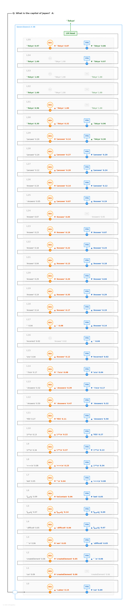
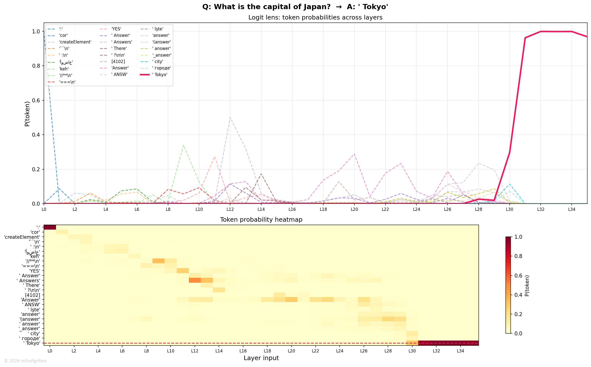

# What is the capital of Japan?

## Token flow

L0–L10 — noise. Random tokens cycle through the residual stream: "cor", "createElement", "//**". No semantic processing yet.

L11 — the model recognizes the Q&A format. "YES" (prob 0.27) appears briefly, then "Answers" (0.50) at L12. These are structural markers — the model understands it's in a question-answer context.

L13–L17 — turbulent zone. Top-1 token jumps between "Answers", "?", "Incorrect", and back. The model is processing the question structure but hasn't started retrieving factual knowledge.

L18–L24 — "Answer" locks in and holds for 7 layers. Prob fluctuates between 0.04 and 0.29. On the surface nothing changes, but the residual stream is accumulating geographic context from the question tokens ("capital", "Japan") through attention.

L25–L27 — subtle refinement: "Answer" → "(answer)". The parenthesized form suggests the model is transitioning from "I need to answer" to "I'm about to produce the answer". Prob is low (0.12–0.24) — the model hasn't committed yet.

L28–L29 — "(answer)" continues. Then at L29 output, FFN delivers the breakthrough: **"Tokyo"** appears as top-1 with prob 0.30. First appearance of the actual answer.

L30 — the critical layer. Attention slightly reinforces Tokyo (+0.02). Then FFN makes a massive push: prob jumps from 0.32 to **0.96** in a single layer. This is where the knowledge neurons fire — the FFN at L30 contains the "capital + Japan → Tokyo" association.

L31 — attention pushes Tokyo to **1.00**. Essentially certain. The answer is locked in.

L32–L34 — maintenance. Both modules preserve Tokyo with prob 0.99–1.00. Minor FFN adjustments but nothing changes the outcome.

L35 — slight erosion. Attention drops prob to 0.87. This is normal for the last layer — the model is preparing for LM Head formatting.

Final output via LM Head: **Tokyo**.

## Flow diagram

## Probability trace

Tokyo (red) is invisible for 29 layers, then a near-vertical rise from 0 to 1.0 in just 2 layers (L29–L31). "Answer" (green dashed) dominates the middle section but vanishes the moment Tokyo arrives. The heatmap shows the clean handoff between structural tokens and the factual answer.

---
© 2026 mihailgribov
