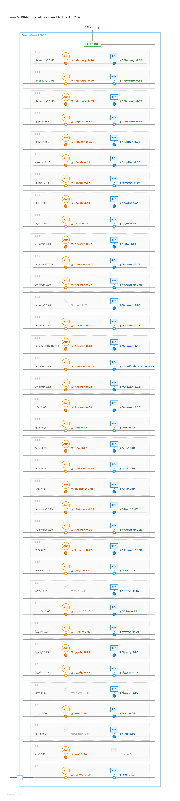
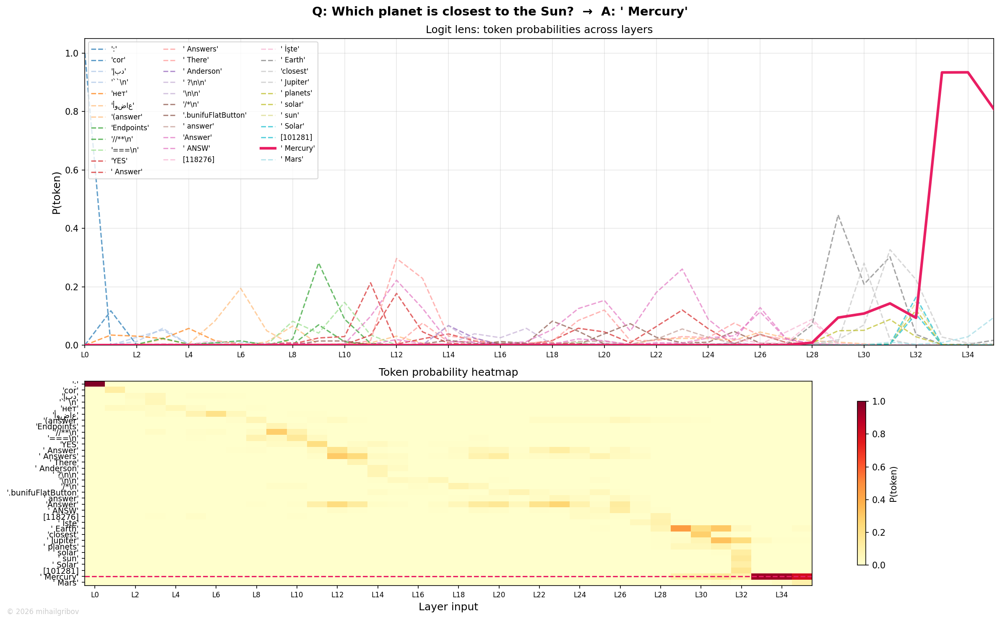

# Which planet is closest to the Sun?

## Token flow

L0–L10 — noise. No semantic content yet.

L11–L12 — Q&A format recognized. "Answers" (prob 0.50) then "Answer" takes over. Standard structural phase.

L13–L17 — astronomy domain emerges. Tokens like "planet", "Earth" briefly appear. The model knows it's about space but hasn't picked a planet yet. The competition between domain tokens is visible — "solar", "Earth", "planet" flicker without any gaining traction.

L18–L27 — "Answer" holds. Long accumulation phase. The residual stream is integrating information from "closest", "Sun", "planet" through attention across these layers. Prob fluctuates (0.05–0.25).

L28–L29 — transition zone. "(answer)" appears. The model is preparing for factual retrieval.

L30 — FFN fires: **"Mercury"** appears as top-1. This is the knowledge retrieval moment. The prob starts at ~0.30 — the model has found the answer but isn't fully confident yet.

L31–L32 — rapid climb. Mercury prob rises to 0.85, then 0.95. Both attention and FFN reinforce. The model is locking in.

L33–L34 — near certainty. Prob ~0.99. The answer is stable.

L35 — slight prob decrease (typical last-layer formatting adjustment). Mercury holds.

Final output via LM Head: **Mercury**.

## Flow diagram

## Probability trace

The chart shows many space-related tokens competing in mid-layers — "Earth", "planet", "solar" — none building sustained probability. Mercury (red) appears around L30 and climbs steeply. Clean factual retrieval with no competing answer in the late layers.

---
© 2026 mihailgribov
