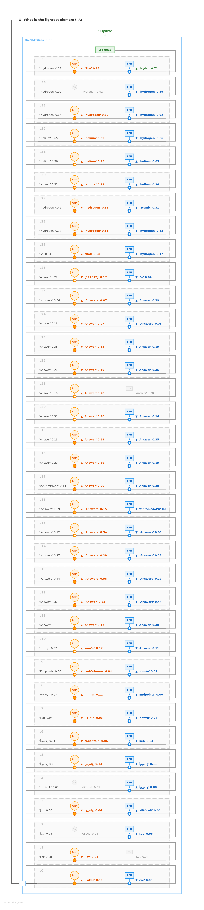
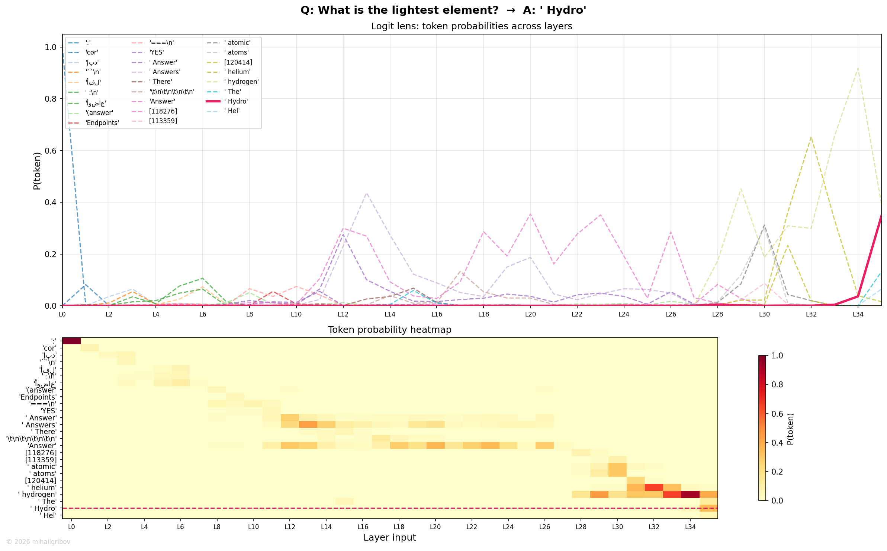

# What is the lightest element?

## Token flow

L0–L10 — noise. The residual stream carries random tokens with no relation to chemistry. This is normal — the model hasn't started processing the question semantically yet.

L11–L12 — the model recognizes the Q&A format. "Answers" (prob 0.50) dominates — this is a structural token, not an answer. The model is saying "I know I need to answer something".

L13–L14 — first interesting signal: **"helium"** briefly appears. The model is already in the right domain (elements) but picked the wrong one. This is the category-level retrieval — "something from periodic table".

L15–L27 — "Answer" takes over and holds for 12 layers. Nothing seems to happen, but internally the residual stream is accumulating information. The prob fluctuates (0.04–0.29) showing that the model is still searching.

L28–L29 — the competition heats up. "(answer)" replaces "Answer" — a subtle shift suggesting the model is getting closer to committing to a specific response.

L30–L32 — FFN makes the call: **"hydrogen"** emerges at L30 and climbs fast. By L32, prob reaches 0.65. By L33, it's at 0.92. This is the knowledge retrieval moment — FFN neurons encoding "lightest + element → hydrogen" fire and push the answer through.

L33–L34 — stabilization. Both attention and FFN maintain hydrogen with minor adjustments. The answer looks settled.

L35 — a surprising twist. The model switches from "hydrogen" to **"Hydro"** — a different subword token that will be followed by "gen" to produce capitalized "Hydrogen". This isn't a change of answer — it's a tokenization decision. The model is choosing how to format the output ("Hydrogen" vs "hydrogen").

Final output via LM Head: **Hydro**(gen) → "Hydrogen".

## Flow diagram

## Probability trace

The prob chart shows the full competition. Multiple candidates flicker in early/mid layers — none builds sustained probability. "hydrogen" (yellow-green dashed) appears around L30 and climbs steadily. At L35, "Hydro" (solid red) takes over — same answer, different tokenization path.

---
© 2026 mihailgribov
