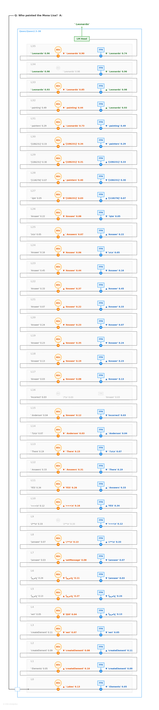
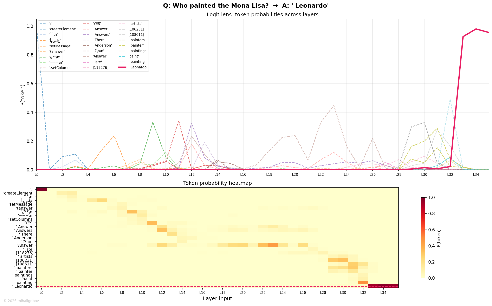

# Who painted the Mona Lisa?

## Token flow

L0–L10 — noise. Random tokens, no semantic processing.

L11–L12 — Q&A format recognized. "Answers" then "Answer". The model knows it needs to respond to a question.

L13–L17 — art domain activates. "painting", "painter", "artist" tokens appear and compete. The model has figured out the category — this is about visual art — but hasn't identified the specific artist. This is the category-level retrieval phase we see across all examples.

L18–L27 — "Answer" takes over for a long stretch. The residual stream is working internally — attention is pulling in context from "painted", "Mona Lisa" in the prompt, building the representation that will trigger the right knowledge neurons.

L28–L30 — transitional layers. Domain tokens reappear briefly — "painting" flickers. The competition between art-related tokens intensifies as the model prepares for final retrieval.

L31–L32 — FFN retrieves the answer: **"Leonardo"** emerges as top-1. The prob starts building — this is the first token of "Leonardo da Vinci". The FFN neurons encoding "Mona Lisa → Leonardo" have fired.

L33–L34 — rapid climb. "Leonardo" prob reaches ~0.90+. Both attention and FFN reinforce. The model is confident.

L35 — "Leonardo" holds through the final layer with minor prob adjustment.

Final output via LM Head: **Leonardo** (followed by " da Vinci" in subsequent generation steps).

## Flow diagram

## Probability trace

The chart shows a clear pattern: art-domain tokens ("painting", "painter") compete in mid-layers, representing the category search. "Leonardo" (red) doesn't appear until L31 but then rises decisively — the transition from "I know it's a painter" to "I know it's Leonardo" happens in just 2 layers.

---
© 2026 mihailgribov
