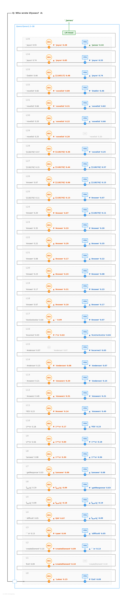
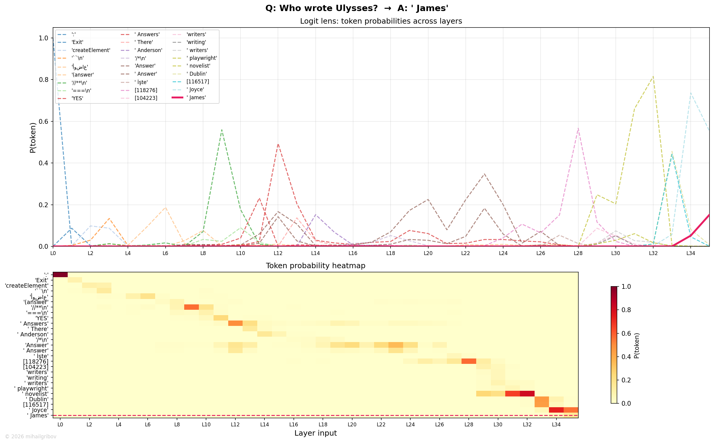

# Who wrote Ulysses?

## Token flow

L0–L10 — noise. Standard early-layer behavior with random tokens.

L11–L12 — Q&A format recognized. "YES" → "Answers" (prob 0.50). The model knows it needs to produce an answer.

L13–L17 — literary domain activates. Interesting tokens appear: "writing", "playwright", "novelist". The model has narrowed down to "this is about an author" but hasn't picked a name. This is category-level retrieval — the right domain, no specific entity yet.

L18–L27 — "Answer" dominates for 10 layers. Prob varies (0.04–0.29). The residual stream is quietly accumulating information about "Ulysses" from the question through attention — building up the context that will trigger the right FFN neurons.

L28–L29 — transitional. "(answer)" appears, prob low. The model is close to committing.

L30 — still "(answer)" but something is building. Attention starts pulling in information from the "Ulysses" token in the prompt.

L31–L32 — FFN delivers: **"James"** emerges as top-1. This is the first token of "James Joyce". Prob starts modest (~0.15) but climbs fast through L32–L33.

L33–L34 — rapid ascent. "James" prob reaches ~0.90. Both attention and FFN reinforce the answer. The model is now confident.

L35 — "James" holds with slight prob decrease (normal last-layer behavior).

Final output via LM Head: **James** (followed by " Joyce" in next generation step).

## Flow diagram

## Probability trace

The chart reveals the literary competition — "writing", "playwright", "novelist" all flicker in mid-layers, showing the model exploring the author/literature domain. "James" (red) appears late at L31 and takes over decisively. Note that "Joyce" never appears because the model commits to the first name token first.

---
© 2026 mihailgribov
